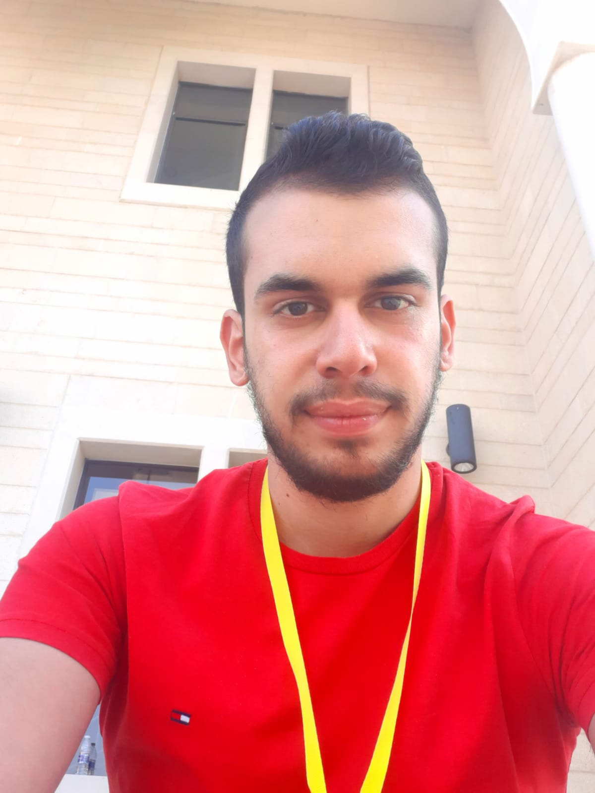

<h1 style="font-size: 50px; text-align:center; color:dodgerblue; letter-spacing: 4px">AZZAM MAHMOUD</h1>
<h3 style="font-size:30px; text-align:center; color: gray; margin-top:-30px;letter-spacing: 2px ">FullStack Web Developer</h3>
<figure>
    
    <figcaption style="font-size: 2rem; color: wheat">Personal image</figcaption>
</figure>

> ## PERSONAL INFO
* Adress: Akkar,North Lebanon
* Natonality: Lebanese
* Phone Number: +96171937852
* Email: azzammahmoud007@gmail.com
* Github: [azzammahmoud95](https://github.com/azzammahmoud95)

>## OBJECTIVE 

 
Fresh graduated student in Informatics.Looking for challenging career that demands the best of my professional ability in terms of technical  and analytical skills that helps me in broadening and enhancing my current skills and knoledge.

>## EDUCATION
* 2022-2021: TS Degree informatics (AL-DAWSA Technical Institude)
* 2019-2018: High-School Degree (Al Kawashera High-school)
* 2016-2015: Brevet Degree (L.W.A High-school)

>## BUSINESS SKILLS
* Leadership
* Communication
* Experience in remote work using Google Meeting and other applicaton
* Multitask
* Excellent interpersonal skills

>## HARD SKILLS
* Programming Logic
* Hardware Logic
* Excellent Computer Skills

>## SOFTWARE
* Microsoft Office Word, Exel,PowerPoint
* Tinkercad for coding tinkercad arduino projects
*  VS code for Desktop Application
* VS code for Website platform design and coding
*  Netbeans

>## PROGRAMMING LANGUAGES
* HTML/CSS,Bootstrap, JavaScript, TypeScript,PHP, Laravel.
* Python, C#, Java, Node JS.
* SQLite.

>## LANGUAGES
* English: Very Good
* Frensh: Good
* Arabic: Native Language

